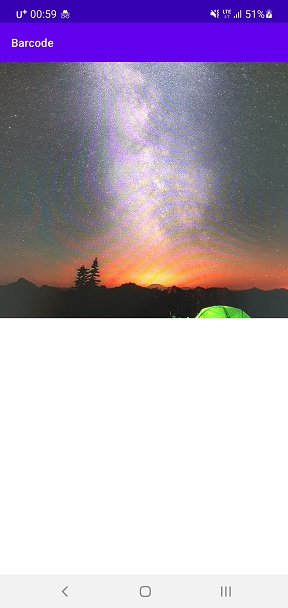

# barcode

This is a sample application supporting scan and decode QR code.

Many of code is based on below project.

- android/camara-samples : https://github.com/android/camera-samples

- Zxing : https://github.com/zxing/zxing

# Screenshots

